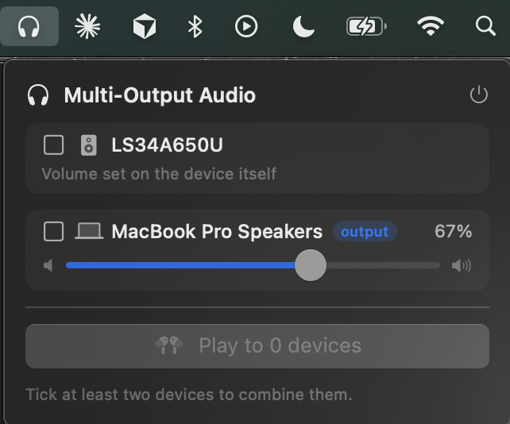

# Multi-Output Audio

Made this for my girlfriend and I to watch the Duton Ranch finale during 4th of July weekend at a small cabin with my family. Updated it a bit afterwards later since it worked so well.

Play your Mac's audio to **several devices at once** — two or more AirPods,
headphones, or speakers all playing the same thing. macOS has no built-in "Share
Audio" like the iPhone does; this fills that gap with a small menu-bar app that
builds a CoreAudio multi-output ("aggregate") device — the same thing Audio MIDI
Setup does, but as one click.



## Getting it running

You set this up once, using the **Terminal** app. For each step below, copy the
command, paste it into Terminal, and press **Return**. A short explanation follows
each one.

**1. Open Terminal.** Press `Cmd` + `Space`, type `Terminal`, and press Return. A
window with a text prompt opens — that's where the commands go.

**2. Install Apple's build tools.**

```sh
xcode-select --install
```

If a box pops up, click **Install** and let it finish. If it says they're already
installed, that's fine — continue.

**3. Download the project.**

```sh
git clone https://github.com/joeyunderwood8/multi-output-audio.git
```

This copies the project into a folder on your Mac called `multi-output-audio`.

**4. Move into that folder.**

```sh
cd multi-output-audio
```

**5. Build the app.**

```sh
./build-app.sh
```

This turns the code into a real Mac app. It takes a few seconds.

**6. Open it.**

```sh
open "Multi-Output Audio.app"
```

A **headphones icon** appears in your menu bar (top-right of the screen, near the
clock and Wi-Fi).

> Next time, you don't need the Terminal — just double-click **Multi-Output Audio**
> inside the `multi-output-audio` folder in Finder.

## Using it

1. Click the **headphones icon** in your menu bar.
2. A panel drops down listing your speakers and headphones.
3. **Tick the box** next to each device you want to play at the same time.
4. Click **Play to N devices** — now they all play the same audio.
5. Each device has its own **volume slider**; drag it to adjust that device.
6. Click **Stop** to go back to a single device.

## Good to know

- 2 devices is rock-solid; 4+ may drop out over Bluetooth.
- The Mac volume keys don't work during a mix — use the sliders in the panel.
- With one device connected, the app leaves your audio alone.
